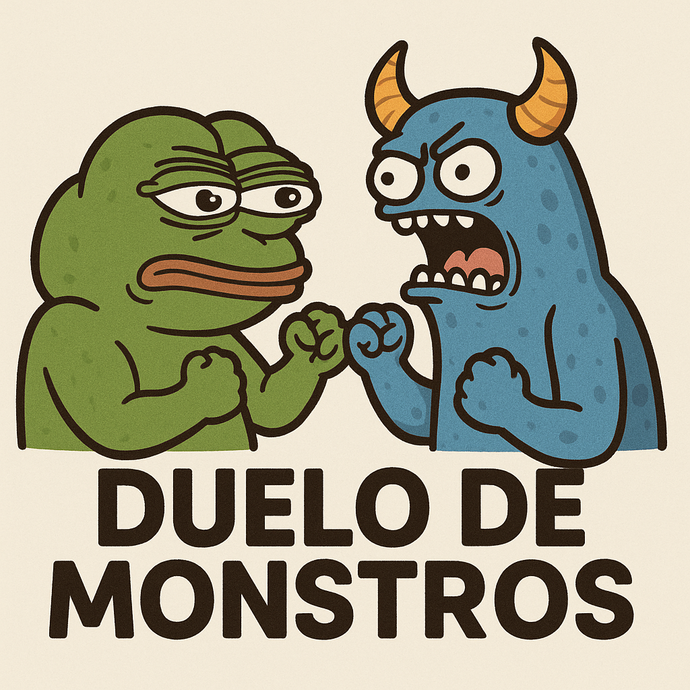

# Monster Battle Arena 🏟️⚔️

<div align="center">
  
</div>

Uma aplicação épica de batalha de monstros com interface arcade moderna desenvolvida em React/Next.js e TypeScript.


## 🎯 Funcionalidades

### ✨ Principais
- **Cadastro de Monstros**: Crie monstros únicos com estatísticas personalizadas
- **Validação de Imagem**: Sistema inteligente que verifica se URLs são imagens válidas
- **Sistema de Batalha**: Algoritmo de combate baseado em turnos com lógica realística
- **Visualização de Batalhas**: Assista às batalhas com animações em tempo real e efeitos visuais
- **Interface Moderna**: Design glass morphism com neon, gradientes e animações suaves
- **Tela de Seleção**: Interface inspirada em Street Fighter para escolha de monstros
- **Interface em Português**: Totalmente traduzida para melhor experiência

### 🎮 Detalhes do Sistema
- **Estatísticas dos Monstros**:
  - `Ataque`: 30-150 pontos
  - `Defesa`: 10-80 pontos 
  - `Velocidade`: 20-120 pontos
  - `HP`: 150-400 pontos
  - `Imagem`: URL validada automaticamente

- **Validação de Imagem**:
  - Verifica extensões válidas (.jpg, .png, .gif, .webp, .svg)
  - Tenta carregar a imagem para confirmar acessibilidade
  - Feedback visual em tempo real (loading, sucesso, erro)
  - Timeout de 5 segundos para URLs lentas

- **Sistema de Batalha**:
  - Monstro mais rápido ataca primeiro
  - Em empate de velocidade, maior ataque vai primeiro
  - Dano = Ataque - Defesa (mínimo 1)
  - Animações de projéteis e feedback visual de dano
  - Barras de HP animadas com cores dinâmicas

## 🚀 Como Rodar a Aplicação

### Pré-requisitos
- Node.js 18+ 
- npm ou yarn ou bun

### Instalação

1. **Clone o repositório**:
```bash
git clone <repo-url>
cd userevi
```

2. **Instale as dependências**:
```bash
npm install
```

3. **Execute o servidor de desenvolvimento**:
```bash
npm run dev
```

4. **Acesse a aplicação**:
Abra [http://localhost:3000](http://localhost:3000) no seu navegador

### Scripts Disponíveis

```bash
npm run dev      # Servidor de desenvolvimento
npm run build    # Build para produção
npm run start    # Servidor de produção
npm run lint     # Verificação de código
```

## 🎨 Design e UI/UX

### Glass Morphism Theme
- **Cores**: Neon blue (#00d4ff), purple (#8b5cf6), pink (#ff006e)
- **Efeitos**: Glass cards com backdrop-blur e bordas translúcidas
- **Gradientes**: Backgrounds e botões com gradientes vibrantes
- **Animações**: Transições suaves, hover effects e pulse animations

### Componentes Principais
- `MonsterCard`: Cards com efeito glass e estatísticas visuais
- `MonsterForm`: Formulário com validação de imagem em tempo real
- `BattleSelection`: Interface fullscreen estilo Street Fighter
- `BattleViewer`: Arena de batalha com animações de projéteis e dano
- `StickFighter`: Representação visual dos monstros em batalha

### Classes CSS Customizadas
- `.glass-card`: Efeito glass morphism
- `.stat-card`: Cards de estatísticas
- `.text-gradient`: Texto com gradiente
- `.button-gradient`: Botões com gradiente animado
- `.neon-button`: Botões com efeito neon
- `.glow-text`: Texto com brilho

## 🏗️ Arquitetura do Projeto

```
src/
├── app/
│   ├── globals.css      # Estilos globais e tema glass morphism
│   ├── layout.tsx       # Layout principal
│   └── page.tsx         # Página inicial
├── components/
│   ├── MonsterCard.tsx     # Card do monstro com glass effect
│   ├── MonsterForm.tsx     # Formulário com validação de imagem
│   ├── BattleSelection.tsx # Seleção estilo Street Fighter
│   ├── BattleViewer.tsx    # Arena de batalha animada
│   └── StickFighter.tsx    # Representação visual dos lutadores
├── hooks/
│   └── useMonsters.ts   # Hook para gerenciar monstros
├── types/
│   └── monster.ts       # Tipos TypeScript
└── utils/
    └── battle.ts        # Lógica de batalha
```

## 🔧 Tecnologias Utilizadas

- **Framework**: Next.js 15.3.3 com App Router
- **Linguagem**: TypeScript
- **Estilização**: Tailwind CSS 4.0 com classes customizadas
- **Persistência**: localStorage
- **Estado**: React Hooks (useState, useEffect)
- **Validação**: JavaScript Image API para validação de URLs
- **Build**: npm/yarn/bun

## 🎲 Como Usar

### 1. Criar Monstros
1. Clique em "✨ Criar Monstro"
2. Preencha o nome do monstro
3. Insira uma URL de imagem (será validada automaticamente)
4. Ajuste as estatísticas usando os sliders coloridos
5. Aguarde a validação da imagem (✓ verde = válida)
6. Clique em "Criar Monstro" quando habilitado

### 2. Criar Monstros Demo
1. Clique em "🎮 Criar Monstros Demo"
2. Dois monstros exemplo serão criados automaticamente
3. Evita duplicatas se já existirem

### 3. Iniciar Batalha
1. Tenha pelo menos 2 monstros criados
2. Clique em "⚔️ Iniciar Batalha"
3. Na tela de seleção estilo Street Fighter:
   - Clique nos portraits dos monstros para selecioná-los
   - Jogador 1 (azul) e Jogador 2 (vermelho)
   - Badges "1P" e "2P" aparecem nos selecionados
4. Clique em "LUTAR!" quando 2 monstros estiverem selecionados

### 4. Assistir à Batalha
- Arena com background em gradiente
- Barras de HP animadas no topo
- Animações de projéteis entre os lutadores
- Feedback visual de dano (bordas vermelhas pulsantes)
- Contador de rodadas e status da batalha
- Declaração do vencedor com animação especial

## 🎯 Algoritmo de Batalha Detalhado

```typescript
1. Determinar ordem de ataque:
   - Se speed1 > speed2 → Monster1 ataca primeiro
   - Se speed1 < speed2 → Monster2 ataca primeiro  
   - Se speed1 = speed2 → Maior attack ataca primeiro

2. Calcular dano:
   - damage = attacker.attack - defender.defense
   - Se damage ≤ 0 → damage = 1

3. Animações visuais:
   - Atacante assume posição de ataque
   - Projétil voa em direção ao defensor
   - Defensor recebe feedback visual de dano
   - HP bar atualizada com animação

4. Aplicar dano:
   - defender.hp = defender.hp - damage
   - Se defender.hp ≤ 0 → Fim da batalha

5. Trocar turnos e repetir até haver um vencedor
```